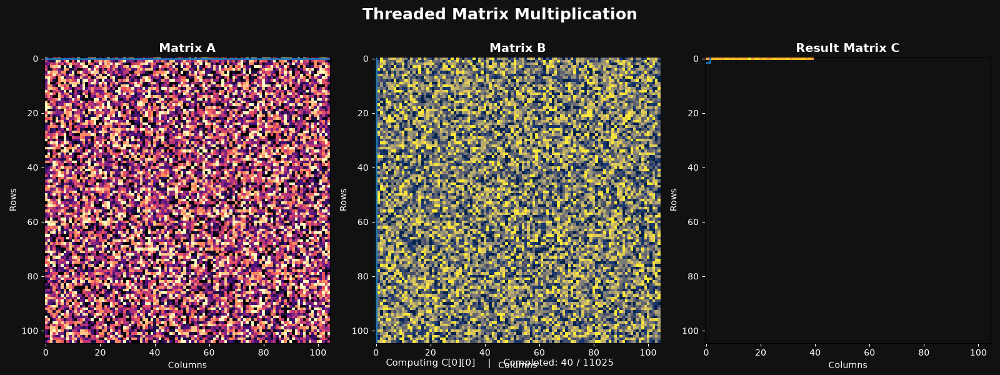

# 💻 OS_Task1

## 🧵 Operating Systems — Thread-Based Implementations

This repository contains the implementations for the Operating Systems thread-based programming assignment.

The assignment demonstrates two fundamental multithreading problems using Python:

1. **Producer–Consumer Problem using Threads**
2. **Matrix Multiplication using Threads with Animation**

---

## 📌 Overview

The programs demonstrate important Operating Systems concepts including:

- Thread creation and execution
- Concurrent execution
- Synchronization
- Shared resources
- Circular buffers
- Thread coordination
- Parallel computation
- Thread completion
- Visualization of threaded computation

---

## 📂 Files in This Repository

| File | Description |
|------|-------------|
| `1) producer_consumer.py` | Implementation of the Producer–Consumer problem using Python threads |
| `2)matrix_multiplication.py` | Thread-based multiplication of two 105 × 105 matrices |
| `matrix_multiplication.gif` | Animation demonstrating the matrix multiplication process |

---

# 1️⃣ Producer–Consumer Problem

## 📖 Description

The Producer–Consumer Problem is a classic synchronization problem in Operating Systems.

A **Producer thread** generates items and places them into a shared buffer, while a **Consumer thread** removes and processes those items.

The implementation uses a fixed-size circular buffer shared between the Producer and Consumer.

## ⚙️ How It Works

- `in_pos` keeps track of the next position where an item will be inserted.
- `out_pos` keeps track of the next position from which an item will be removed.
- The buffer operates as a circular buffer using the modulo operation.
- `threading.Condition` is used for synchronization.
- The Producer waits when the buffer is full.
- The Consumer waits when the buffer is empty.
- `notify()` is used to wake the waiting thread when the buffer state changes.

This prevents incorrect access to the shared resource while allowing both threads to execute concurrently.

## 🧠 Concepts Demonstrated

- Python Threads
- Producer–Consumer synchronization
- Shared resources
- Circular buffer
- Locks
- Condition variables
- `wait()` and `notify()`
- Concurrent execution

---

# 2️⃣ Matrix Multiplication Using Threads

## 📖 Description

The second program performs multiplication of two **105 × 105 matrices** using Python threads.

Each result cell is calculated through an independent threaded computation.

The program records the completion of the threaded computations and uses the recorded execution order to generate an animation.

## ⚙️ How It Works

For matrix multiplication:

```text
Matrix A (105 × 105) × Matrix B (105 × 105)
                    ↓
              Matrix C (105 × 105)
```

The resulting matrix contains **11,025 cells**.

Each cell of Matrix C is calculated using one row from Matrix A and one column from Matrix B.

The threaded computations run concurrently, and the completed cells are recorded for visualization.

---

## 🎬 Matrix Multiplication Animation

The animation visually demonstrates the progress of the threaded matrix multiplication.

- **Matrix A** represents the first input matrix.
- **Matrix B** represents the second input matrix.
- **Matrix C** displays the result as computations are completed.
- **Row and column indicators** show the current computation.
- The animation is generated using **Matplotlib Animation**.

### 🎥 Animation



---

## 🛠️ Technologies Used

- **Python 3**
- **Python `threading`**
- **NumPy**
- **Matplotlib**
- **Matplotlib Animation**

---

## ▶️ How to Run

### 1. Install the Required Libraries

```bash
pip install numpy matplotlib
```

### 2. Run the Producer–Consumer Program

```bash
python "1) producer_consumer.py"
```

### 3. Run the Matrix Multiplication Program

```bash
python "2)matrix_multiplication.py"
```

The matrix multiplication program performs the threaded computation and generates the matrix multiplication animation.

---

## 🎯 Learning Outcomes

This assignment provides practical understanding of:

- Thread creation and execution
- Synchronization
- Shared-memory access
- Producer–Consumer coordination
- Circular buffers
- Parallel cell computation
- Thread completion
- Visualization of concurrent computation

---

## 👩‍💻 Author

**Kashish T Karkera**
**NNM24IS102**

*Operating Systems — Thread-Based Programming Assignment*
